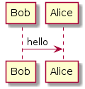

# DocFx.Plugins.PlantUml

[](https://ci.appveyor.com/project/KevReed/docfx-plugins-plantuml)

DocFx.Plugins.PlantUml is a template for DocFx to allow DFM (DocFx MarkDown) documents to render diagrams using PlantUml

## Installation Instructions

DocFx.Plugins.PlantUml uses [PlantUml.Net](https://github.com/KevReed/PlantUml.Net).
Ensure you have installed the [requirements](https://github.com/KevReed/PlantUml.Net#requirements)

### Project Installation via NuGet

This method assumes you are including docfx.console.

(using package manager)

```PM
Install-Package DocFx.Plugins.PlantUml
```

Installing in this way will explicitly set the templates used in your project, *the templates specified in docfx.json will be ignored!*

To specify templates add them in a comma seperated list to the `DocTemplate` property in your project file.

e.g.

```xml
<PropertyGroup>
  <DocTemplate>default,my-custom-template</DocTemplate>
</PropertyGroup>
```

### Manually Installation

1. Use nuget.exe to install to the project directory

```command
nuget install DocFx.Plugins.PlantUml -ExcludeVersion -OutputDirectory .
```

2. Add to docfx.json

Now you need to tell DocFx where to find the new template...

assuming you extracted the package to the project directory:

in docfx.json:

```json
...
    "template": [
      "default",
      "DocFx.Plugins.PlantUml/template"
    ]
...
```

### Download PlantUml

[download plantuml](http://plantuml.com/download) (pick whichever licence suits your needs), the .jar can be placed directly into the project root, or an alternate configuration can be specified in your docfx.json

```json
...
    "markdownEngineProperties": {
      "plantUml.localPlantUmlPath": "path/to/plantuml.jar"
    },
...
```

## Usage

To render a PlantUml diagram add a code block to you markup:

````markdown
```plantUml

Bob->Alice : hello

```
````

should render:



### Settings

The plugin can be configured in your docfx.json
the following options are available

| Setting                        | Description                                                             | Default                                 |
|--------------------------------|-------------------------------------------------------------------------|-----------------------------------------|
| plantUml. javaPath             | path to java installation                                               | uses the JAVA_HOME environment variable |
| plantUml. localGraphvizDotPath | path to graphviz dot exe (required for local rendering mode only)       | none                                    |
| plantUml. localPlantUmlPath    | path to plantuml.jar                                                    | will look in project directory          |
| plantUml. outputFormat         | format of generated images (currently only svg is supported)            | svg                                     |
| plantUml. remoteUrl            | url to remote PlantUml server (required for remote rendering mode only) | http://www.plantuml.com/plantuml/       |
| plantUml.renderingMode         | remote or local                                                         | remote                                  |

example:

```json
...
    "markdownEngineProperties": {
      "plantUml.javaPath": "C:/Program Files/Java/jre1.8.0_171",
      "plantUml.localGraphvizDotPath": "C:/Program Files (x86)/Graphviz2.38/bin/dot.exe",
      "plantUml.localPlantUmlPath": "plantuml.jar",
      "plantUml.outputFormat":"png",
      "plantUml.remoteUrl":"http://www.plantuml.com/plantuml/",
      "plantUml.renderingMode":"remote",
    },
...
```

### Diagram syntax

* [Sequence diagram](http://plantuml.com/sequence-diagram)
* [Usecase diagram](http://plantuml.com/use-case-diagram)
* [Class diagram](http://plantuml.com/activity-diagram-beta)
* [Activity diagram](http://plantuml.com/activity-diagram-beta)
* [Component diagram](http://plantuml.com/component-diagram)
* [State diagram](http://plantuml.com/state-diagram)
* [Object diagram](http://plantuml.com/object-diagram)
* [Deployment diagram](http://plantuml.com/deployment-diagram)
* [Timing diagram](http://plantuml.com/timing-diagram)

see the [PlantUml reference guide](http://plantuml.com/PlantUML_Language_Reference_Guide.pdf) for more details